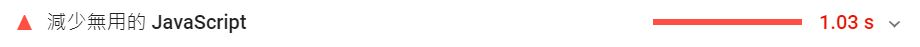

### 問題一


靜態html的處理方式:

```html
<!-- 原本 -->
<script src="https://cdnjs.cloudflare.com/ajax/libs/aos/2.0.2/aos.js"></script>

<!-- 加defer or async -->
<script defer src="https://cdnjs.cloudflare.com/ajax/libs/aos/2.0.2/aos.js"></script>
```
<br>
<br>
<br>
vue的處理方式:

```js
/*原本*/
import About from '../views/About.vue'
{
    path: '/about',
    name: 'About',
    component: About
},


/*處理*/
{
    path: '/about',
    name: 'About',
    component: () => import( /* webpackChunkName: "about" */ '../views/About.vue')
},
```
<br>
<br>
<br>

### 問題二



靜態html的處理方式:
```html
<!-- 原本 -->
<script src="https://cdnjs.cloudflare.com/ajax/libs/aos/2.0.2/aos.js"></script>
<br>
<br>
<br>
<!-- 處理，不同頁面分割 -->
<!-- index.html -->
<script defer src="index.js"></script>
<!-- about.html -->
<script defer src="about.js"></script>
```

vue的處理方式:

webpack分割
<br>
<br>
<br>

### 問題三

靜態html的處理方式:

```html
<!-- 原本 -->
<link rel="stylesheet" href="main.css">

<!-- 處理，不同頁面分割 -->
<!-- index.html -->
<link rel="stylesheet" href="index.css">
<!-- about.html -->
<link rel="stylesheet" href="about.css">
```
<br>
<br>
<br>
vue的處理方式:
<br>
<br>
webpack分割
